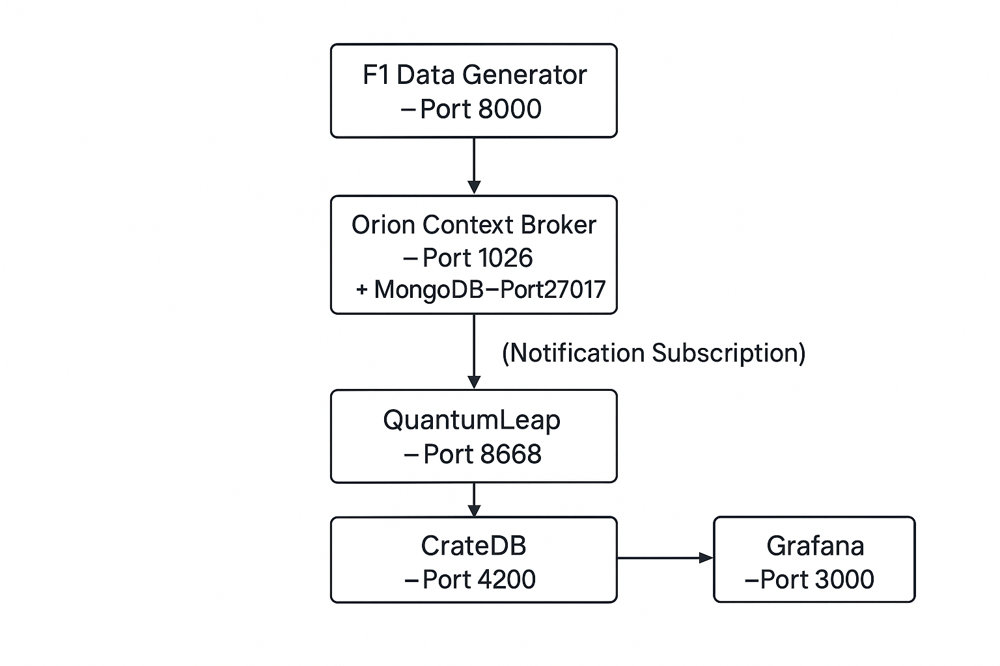

# 🏎️ F1 Digital Twin – Real-Time Telemetry System with FIWARE & Grafana

## 📘 Introduction

This project implements a **Digital Twin** of a Formula 1 (F1) car using an IoT and data visualization stack based on **FIWARE**, **CrateDB**, and **Grafana**.

### 🔍 What is a Digital Twin?

A **Digital Twin** is a real-time virtual representation of a physical system—in this case, an F1 car. It mirrors telemetry data such as speed, RPM, gear, and more. The Digital Twin enables:

- Continuous monitoring of the car’s performance
- Real-time data visualization
- Simulation for testing strategies or behaviors
- Demonstration of smart mobility/IoT frameworks

---

## 🧠 State of the Art – Real F1 Telemetry Systems

Digital Twin technology is used heavily in Formula 1.

### 🏁 Vodafone McLaren Mercedes Telemetry Dashboard (Reference)

The Vodafone McLaren Mercedes team built a telemetry system capable of showing:

- Live speed, RPM, gear state
- Sector/lap timing and progress
- Tyre pressure, brake temps, fuel levels
- Engine diagnostics and GPS position

📷 Example:


> *Source: McLaren Technology Centre*

---

## 🏗️ How the Digital Twin is Built

This project emulates the behavior of a Formula 1 car by combining real telemetry from past races with real-time IoT architecture.

### 🧪 Data Generation using FastF1

We use the **[FastF1](https://theoehrly.github.io/Fast-F1/)** API to simulate a real F1 race session. This powerful Python library allows us to extract:

- Speed
- RPM
- Gear
- Driver code
- DRS state
- Time within the lap

from actual telemetry logs (e.g., 2022 Monza Grand Prix). These values are updated in real time and **transformed into NGSI v2-compliant entities**, representing the virtual state of the car.

Each entity is structured as an `F1_Car` object and sent to the **FIWARE Orion Context Broker**, which acts as the central receiver of all contextual information.

### 🔁 Subscription to QuantumLeap

A **subscription** is created between Orion and **QuantumLeap** (a time-series translator). This subscription allows every update on F1_Car entities to be forwarded automatically and stored in **CrateDB**, which acts as a time-series database.

This creates a historical log of car behavior—exactly like in real F1 data telemetry centers.

### 📊 Visualization (Grafana + Streamlit + 3D)

We use a **hybrid visualization** approach:

#### 📈 Grafana Dashboards

- A dashboard in Grafana fetches data from CrateDB (via PostgreSQL plugin).
- It visualizes time-series metrics: speed, RPM, gear shifts, and lap timing.
- We use the `htmlgraphics` plugin to **embed custom HTML views** inside Grafana.

#### 🖼️ Streamlit Simulation

To simulate the race visually:
- A **Streamlit app** runs alongside the backend and uses the **FastF1 API** to draw the circuit layout.
- The **driver’s current position** is plotted live on the track.
- A **3D McLaren car model** is served via **NGINX**, and displayed inside Grafana using the `HTMLGraphics` panel.

This combination allows Grafana to act not only as a metrics dashboard, but as a **real-time cockpit**, mixing charts and 3D visualization.

---

## 🧱 System Architecture


---

## 📦 docker-compose.yml Overview

The `docker-compose.yml` launches the following services:

- **orion**: Context Broker for receiving telemetry (port `1026`)
- **mongo**: Required by Orion for context metadata
- **quantumleap**: Translates context to time-series (port `8668`)
- **crate**: Stores telemetry data (port `4200`)
- **grafana**: Visualizes metrics (port `3000`)
- **f1_data_generator**: Simulates the F1 telemetry stream

---

## 🔧 Installation & Startup

### 1️⃣ Clone the repository

```bash
git clone https://github.com/Marwenbellili72/F1_Digital_Twin.git
cd F1_Digital_Twin
````

### 2️⃣ Build and start services

```bash
docker-compose up --build -d
```

### 3️⃣ Check running containers

```bash
docker ps
```

Services will be available at:

* Orion: `http://localhost:1026`
* QuantumLeap: `http://localhost:8668`
* CrateDB Admin UI: `http://localhost:4200`
* Grafana UI: `http://localhost:3000` (default: admin/admin)

---

## 🚗 F1 Car Entity (NGSI Format)

An example F1 entity sent to Orion:

```json
{
  "id": "car001",
  "type": "F1_Car",
  "speed": { "type": "Number", "value": 310 },
  "rpm": { "type": "Number", "value": 14200 },
  "gear": { "type": "Number", "value": 7 },
  "drs": { "type": "Boolean", "value": true },
  "driverCode": { "type": "Text", "value": "VER" },
  "timeWithinLap": { "type": "Number", "value": 34.2 }
}
```

---

## 🔁 Subscription to QuantumLeap

`subscription.py` sets up a subscription to send all updates from `F1_Car` entities to QuantumLeap:

```json
{
  "description": "Notify QuantumLeap",
  "subject": {
    "entities": [{ "idPattern": ".*", "type": "F1_Car" }]
  },
  "notification": {
    "http": { "url": "http://quantumleap:8668/v2/notify" },
    "attrsFormat": "normalized"
  },
  "throttling": 1
}
```

---

## 📊 Grafana Dashboard

* Grafana uses CrateDB as a data source (via PostgreSQL plugin).
* The dashboard displays **real-time graphs** for speed, RPM, gear, and lap time.
* Use `grafana.json` to import the default dashboard layout.

### 👀 Example Screenshot



---

## 🗂️ Project Structure

```
F1_Digital_Twin/
├── f1_data_generator/
│   ├── generator.py         # Generates and sends F1 data to Orion
│   └── subscription.py      # Registers the subscription to QuantumLeap
├── grafana.json             # Preconfigured dashboard export
├── docker-compose.yml       # Main orchestration file
├── img.png                  # Screenshot of Grafana dashboard
└── README.md
```

---

## 🧪 Testing & Querying

Test Orion from the host machine:

```bash
curl http://localhost:1026/v2/entities
```

Access CrateDB web UI:

* Visit `http://localhost:4200`
* Example SQL query:

  ```sql
  SELECT * FROM et_f1_car;
  ```

---

## 📄 License

This project is licensed under the MIT License. See the `LICENSE` file for details.

---

## 📬 Contact

> **Marwen Bellili**
> 📧 [marwenbellili72@gmail.com](mailto:marwenbellili72@gmail.com)
> 🐙 GitHub: [Marwenbellili72](https://github.com/Marwenbellili72)

---
